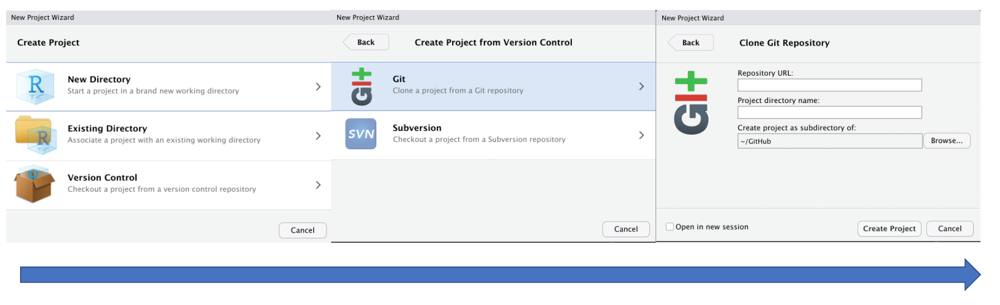
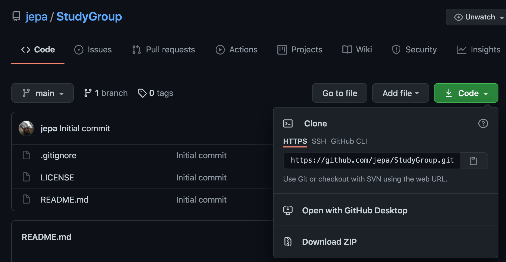
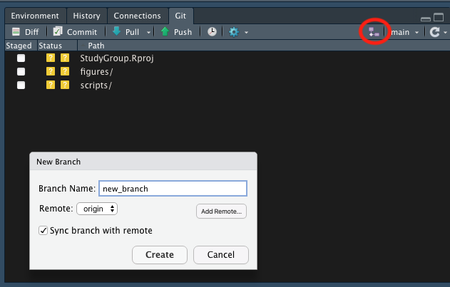

# Create a new repository

There are two (at least!) ways to create a new repository. You can choose the one you feel more comfortable about! Overall, you will have complete the following things:

- *Name*: you want it to be short and on point
- *Description*: allays good to have a brief description of what the repository is about
- *Local Path*: This is where you will save the repository in your computer
- *Initialize this repository with a README* Strongly recommended
- *Git Ignore*: This is a file that will allow you to exclude certain files from *sync*. Choose *R* if you're an R user
- *License*: It is always good to, at least, have one license, even if is open access work
- *Public or private*: If you pay or are a student, you can have private repositories.

## **GitHub web page**

From this steo you will create the repository from the GitHub webpage. Go to GitHub and select the + sign in the top right, a sub menu will drop, just choose "New repository." After that just fill in the information and your repository will be created.

### Link the repository with R-Studio.

Once you create the repository you will have to link it to R-Studio so you can control your workflow. The way you create the repository will mark the way you connect. If you created the repository on the website, follow these steps to link it to R:

1.- Open R-Studio, go to "File" -> "New Project". Alternatively, on the top right Corner will say (should say) "Project (None)", the first option once you click should be "New Project...". A pop-pit window should appear. Go on and click on "Version Control" and then "Git". You should get to the third panel below.

2.- Once there, go to your repository home screen in the browser and click on the green button that says "Code". A pop up window should come out. Copy the "HTTPS" link (In the picture below, the link would be `https://github.com/jepa/StudyGroup.git`) 

3. - Go back to R-Studio and paste the link on the "Repository URL:" of your New Project Wizard window. The *Project directory name* will automatically show the name of your repo. (I suggest you keep the same). Finally, select the sub-directory in your computer where you will keep the repository. Click on "Create Project" and let the magic begin... 

## **GitHub Desktop.** 

This might be the most straight forward way to create a new repository from your computer. If you downloaded [gitHub Desktop](https://desktop.github.com/), go to `File` -> New Repository, a `Create a New Repository` window like the one below should pop out.

### Link the repository with R-Studio.

Now we go to R-Studio to link it to the new repository in one single step:

1.- Open R-Studio, go to "File" -> "New Project". Alternatively, on the top right Corner will say (should say) "Project (None)", the first option once you click should be "New Project...". A pop-pit window should appear. Go on and click on "Existing Directory" and then "Browse". Now, locate the Repository you created on the GitHub Desktop and that's it!

Regardless of the method you choose. Your R-Studio project should look something like this:

# Solo GitHub

Technically speaking, GitHub was designed for collaborative work. However, I find it SUPER useful for solo work as well. Also, the more you work on it as a solo user, the more prepared you'll be for when you have to collaborate. In this section we will cover the following *tools* GitHub has to offer such as *Issues*, *Branches*, and *web page*. 

## The README file.

The `README.md` files are one of the most useful tools of GitHub. These files are shown directly in the repository and can work as a guidance to your repo. Let's take a moment to write our `README.md`. Here are some examples; [This Repo](https://github.com/jepa/StudyGroup), [FishForVisa](https://github.com/jepa/FishForVisa), [OHI-Science](https://github.com/OHI-Science/data-science-training).

**TASK:** Take some time to populate our `README.md` file. Remember, every time you make a change to the repository you will need to "Commit" that change

## Issues

How many of you have comment on your code things like `# Change this value when new data arrive"` and then completely forgot about it? Well, the *Issues* tab is here for you! Basically, we document all the issues we find in our code, and weather or not we have dealt with them. Issues become a key aspect of collaborative projects and the exchange between collaborators stays there.

### Setting an Issues template

I like to have a standardized way of presenting issues. For that, go to the *Insights* tab, select *Community* on the left-side menu, and click on `Add` *Issues templates*. Depends on what the repository is, you can choose from some options. For my personal projects I just use a modification of the `Bug template`. 

**TASK:** Create an Issue template for your repository

### Create a New Issue

Go to the *Issues* tab and click on the green button "New issue". Some things in the issue:

- **Assignees**: When collaborating, you can assign specific colaborators to specific issues. 
- **Labels**: A nice way to keep track of similar issues (e.g., coding, data, function)

**TASK:** Create an Issue with a Label. Respond to that issue and close it. 

## Branches

Branches are a way you can explore parts of your project without altering the main product. Think about it this way. 

Lets imagine you just finished all of your paper's analysis in the `master` branch (all projects start on this branch). Analysis, results, figures, everything is nicely done. You send the paper to your co-authors and one of them asks you what would happen if, instead of averaging your results by 10 years you average them by 20 years. A relative big task that will take you some time to compute. 

In the heat of the moment you forget about branches, go to your analysis script, and comment out some parts of your code, change parts of the code, change your plots, axis, and all the shenanigans. You get the final results and present it to the co-authors. Guess what, the co-author decided that the original analysis was fine. 

At this point you made sooooooo many changes in the analysis script that it takes you a week to figure out where you were in the original analysis. Also, you can't really just go back on the version control because you made substantial changes to the manuscript in parallel and you would loose those, oh my!

On a parallel universe, you created a new branch called `time_test` to work on this request. In this universe your co-author and you decided that this is a better approach. In this case you do a `Pulll Request` and eventually *merge* the `time_test` branch to the `master`. Now, your `master` branch includes the analysis script of the `time_test` and the changes to your manuscript file are not lost. 

### New branch

To create a new branch you have two options. In R-Studio go to the `Git` tab and click on that "purple funny icon". A pop-out window will appear, just type in the new branch name and that's it. Note that the project will immediately switch to work on that branch. 

### Merge Branch

**TASK:** Crete a new branch do some alterations to an existing document and merge that branch to the main.

## Project webpage

GitHub has a cool option that allows you to have an `rmarkdown`-based web-page for your project. The best part of it is that with a couple of clicks, you get a nice template!

Go to *Settings* and click on *Pages* on the left menu (the last one).

